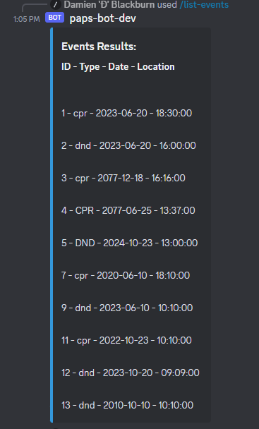
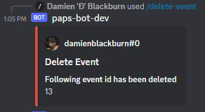
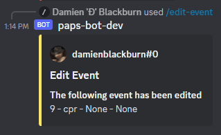
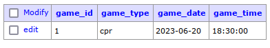
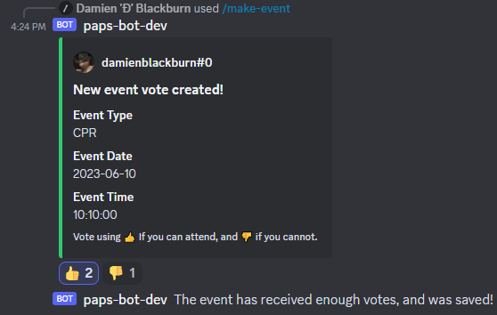

# Paps-Bot: A lightweight Discord Companion for Pen-and-Paper Shenanigans

Managing and organizing pen-and-paper gaming sessions just got a whole lot easier with Paps-Bot! Say goodbye to the hassle of coordinating events manually, and welcome a seamless experience with our Discord bot designed specifically for planning and executing your tabletop adventures.

## Overview

Paps-Bot is a lightweight Discord bot that streamlines the process of setting up and participating in pen-and-paper events. Its primary focus revolves around leveraging the Discord bot API to receive and execute commands related to event planning, with additional support for organizing and displaying event reminders,
using a postgreSQL database to store and handle the events.

In the course of developing Paps-Bot, I delved into the intricacies of asynchronous Python programming, SQL, and various packages revolving around this, in order to provide a robust foundation for a smooth and efficient user experience.

## Hosting the bot
Whether you prefer local hosting or a server setup, Paps-Bot accommodates both options to suit your needs. The deployment process is made simple using Docker, ensuring a hassle-free installation and setup.

To get started, clone the repository to your local machine or server. Obtain a unique access token by registering your bot on the [Discord Developer Portal](https://discord.com/developers/docs/intro), and secure it in a `dev.env`` file at the root of the repository:

```DISCORD_TOKEN=(your token)``````

Invite the bot to your Discord server and use Docker Compose to build the image and launch the bot, database, and Adminer (a PostgreSQL GUI):
```docker-compose up --build```

## How it works
Paps-Bot employs asynchronous commands to communicate with the integrated Discord bot API, enabling a diverse range of events. For example, executing the /list-events command triggers the Discord bot API to execute a pre-programmed command:

Listing events by command:


Paps-Bot manages the formatting, submission of commands to a PostgreSQL database, retrieves relevant data, and posts it as a chat message in the Discord server.

Moreover, Paps-Bot utilizes Docker to compartmentalize services, hosting different components in separate containers for seamless integration while maintaining a secure and isolated environment.


---
## Examples of commands
Explore the versatility of Paps-Bot through various commands, allowing you to list events, delete events by ID, and even edit events with new content:

```/list-events  - Lists events, searchable with prompts```



```/delete-event - deletes event by id```




```/edit-event - edit event by id and new content```



After executing these commands, Paps-Bot formats and sends requests to the database, pulls relevant data, and posts it as a chat message.



---

## Vote for events!
Participating members can submit events in the form of a vote. If enough members vote for an event, it will be saved; otherwise, it will be discarded:



---

### UPDATE:
Enjoy a cleaner interface with the implementation of slash commands. All commands have been converted to slash command format:


---

### WIP features:
Attendee signup:
Discord server members can associate their user to the bot, allowing for event signups, reminders, and more.
